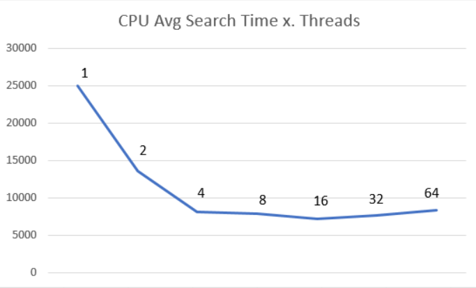

# CUDA vs CPU for pattern searching: which is faster?
This is an experimental proof-of-concept project that compares the differences in runtime between a CPU and GPU executing similar implementations of the Boyer Moore pattern search algorithm to count the number of substrings in a very large input string. I test to see how the number of threads impacts runtime, and compare the CPU and GPU against each other.

# Design
Both implementations first read the entire input .txt file into a buffer, so that time spent reading the file into memory does not affect our runtime results. Then, each thread is alotted a chunk of the input buffer to process. A shared count variable is incremented each time a thread finds an instance of the search pattern. The executables are invoked with the following arguements:
* `CPUTextSearch.exe <path to file> <search pattern> <number of threads>`
* `CUDATextSearch.exe <path to file> <search pattern> <number of thread blocks> <number of threads>`

# Testing and Results
I used 3 .txt files I found online: the entirity of Shakespeare's works, Moby Dick, and a file containing a compilation of data from Wikipedia. The graphs below show an average runtime for searching the each file for the substring "Thou" timed using `chrono::high_resolution_clock`. Honestly I should've tested this more but I wanted to start another project.

# Conclusion
The CPU and GPU are comparable in performance. The CPU performs better under normal circumstances, but when looking for optimal performance the GPU is superior - at least on my computer and with these test cases. All tests were run on my XPS-15 laptop running an 8 core i7 and nvidea 1050ti. 
###### Next time you want to search a .txt file for a substring, don't press ctrl-f. Clone this repo and use your GPU like a boss
